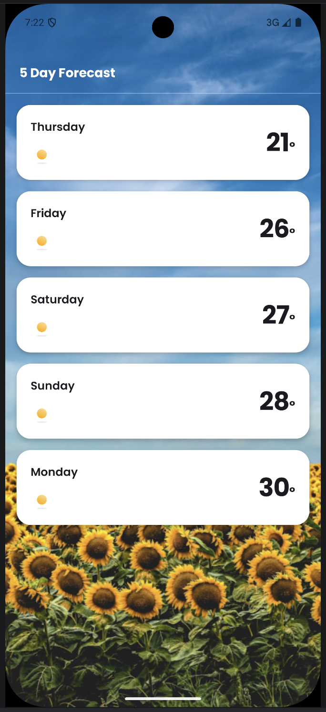
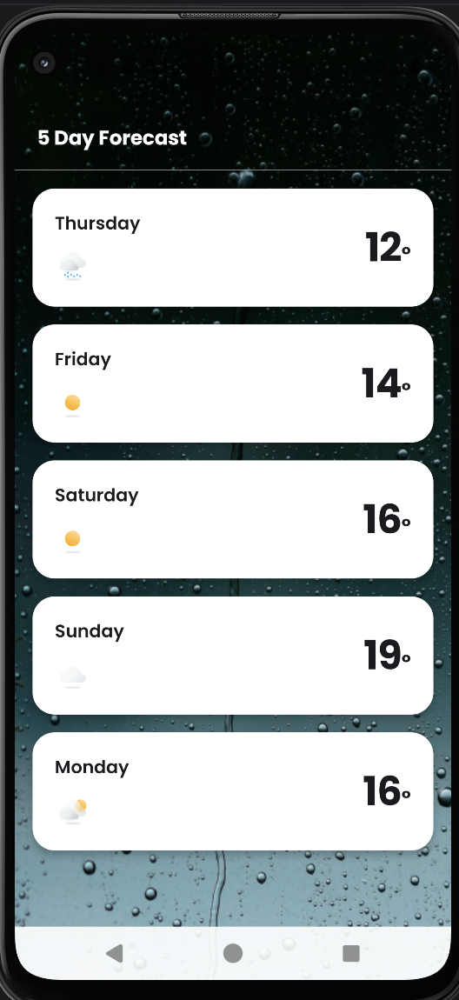

# DVT Weather App

A 5-day weather forecast app for Android, built with Kotlin and Jetpack Compose. The forecast is based on the device's current location, and the screen background switches between three provided illustrations (Sunny / Cloudy / Rainy) depending on the current weather condition.

## Overview

- Requests the user's current location at runtime, then fetches a 5-day / 3-hour-step forecast from [OpenWeather](https://openweathermap.org/forecast5) for those coordinates.
- Buckets the ~40 three-hour entries the API returns into 5 daily cards, picking the reading closest to local noon as each day's representative temperature.
- Renders a full-bleed background image matching the current weather condition, with a "5 Day Forecast" title bar and a scrollable list of day cards (day name, weather icon, temperature) on top.

## Screenshots

| Sunny | Rainy |
|---|---|
|  |  |

## Architecture

Clean Architecture, four layers plus a cross-cutting utilities package, all under `app/src/main/java/com/example/weatherappdvt/`:

```
domain/          Pure Kotlin — no Android or third-party imports
  model/         Forecast, DailyForecast, WeatherCondition, LocationCoordinates
  repository/    WeatherRepository, LocationRepository (interfaces only)
  usecase/       GetForecastUseCase, GetCurrentLocationUseCase

data/            Implementations of the domain interfaces
  remote/        Retrofit service + DTOs matching OpenWeather's JSON shape
  mapper/        DTO → domain model conversion (incl. the day-bucketing logic)
  repository/    WeatherRepositoryImpl, LocationRepositoryImpl

di/              Hilt modules binding domain interfaces to data implementations
  NetworkModule.kt      OkHttp / Retrofit / kotlinx.serialization wiring
  RepositoryModule.kt   @Binds WeatherRepository → WeatherRepositoryImpl, etc.

presentation/    ViewModel + Compose UI, organized by feature
  forecast/      ForecastViewModel, ForecastUiState, ForecastScreen, ForecastDayCard

utils/           Small pure-function helpers (weather icon/condition mapping)
```

**The rule that makes this "clean" rather than just organized:** dependencies point inward. `domain/` has zero knowledge of Android, Retrofit, or Compose — it only defines interfaces and plain data classes. `data/` and `presentation/` depend on `domain/`, never the other way around. This is what lets the ViewModel and use cases be unit-tested on the plain JVM, with no emulator or Robolectric required.

### State management

`ForecastViewModel` exposes a single `StateFlow<ForecastUiState>`, where `ForecastUiState` is a sealed interface with four variants: `PermissionRequired`, `Loading`, `Success(forecast)`, `Error(message)`. The Compose screen renders an exhaustive `when` over this state — the compiler enforces that every state is handled, and adding a new state would fail to compile until the UI accounts for it.

## Conventions

- Idiomatic Kotlin naming throughout (camelCase properties, PascalCase classes) — Compose functions are PascalCase per the standard Jetpack Compose convention (they read as components, not verbs).
- `presentation/` is organized by feature (`presentation/forecast/`), not by layer-within-layer, so a second screen would become its own `presentation/<feature>/` package without disturbing this one.
- Constructor injection everywhere (`@Inject constructor`) — no field injection, no service locators.
- Kotlin DSL (`build.gradle.kts`) throughout, with a version catalog (`gradle/libs.versions.toml`) as the single source of dependency versions.

## Third-party dependencies

| Dependency | Purpose |
|---|---|
| **Hilt** (`com.google.dagger:hilt-android`) | Dependency injection — compile-time-verified graph, first-class `hiltViewModel()` support in Compose. |
| **Retrofit** + **kotlinx.serialization** converter | Type-safe HTTP client for the OpenWeather API, with Kotlin-native JSON (de)serialization — no reflection, works directly with `@Serializable` data classes. |
| **OkHttp logging interceptor** | Logs HTTP request/response bodies during development. |
| **Play Services Location** (`com.google.android.gms:play-services-location`) | `FusedLocationProviderClient` for retrieving the device's current coordinates. |
| **MockK** | Mocking `suspend` functions and interfaces in unit tests — Kotlin-first, no extra shims needed for coroutines or final classes. |
| **Turbine** | Ordered, suspending assertions against `StateFlow`/`Flow` emissions in ViewModel tests. |
| **OkHttp MockWebServer** | Runs a real local HTTP server in repository tests, exercising the full Retrofit + serialization + mapper pipeline against realistic JSON fixtures. |
| **kotlinx-coroutines-test** | `StandardTestDispatcher` and `runTest` for deterministic coroutine testing. |
| **detekt** | Static analysis — cyclomatic complexity, naming, formatting, unused code. |
| **Jacoco** | Code coverage reporting over unit tests. |

All of the above fall within the assessment's allowed categories for third-party packages (dependency injection, platform resource access, serialization, and testing/tooling) — no third-party functional or UI component libraries are used; all UI is built directly with Jetpack Compose and Material 3 primitives.

## Build instructions

1. Clone the repository and open it in Android Studio (or use the command line with a configured Android SDK).
2. Create `local.properties` in the project root (if Android Studio hasn't already) and add your own OpenWeather API key:
   ```
   sdk.dir=/path/to/your/Android/sdk
   WEATHER_API_KEY=your_openweather_api_key
   WEATHER_BASE_URL=https://api.openweathermap.org/data/2.5/
   ```
   This file is gitignored — the key is never committed. If `WEATHER_API_KEY` is absent, the app still compiles (falls back to an empty string), which is what allows CI to build without secrets.
3. Build and run:
   ```
   ./gradlew assembleDebug
   ```
4. Run the unit tests:
   ```
   ./gradlew testDebugUnitTest
   ```
5. Run static analysis:
   ```
   ./gradlew detekt
   ```
6. Generate a coverage report:
   ```
   ./gradlew jacocoTestReport
   ```
   Output: `app/build/reports/jacoco/jacocoTestReport/html/index.html`

On first launch, the app requests `ACCESS_COARSE_LOCATION` — grant it to see the forecast for your current location.

## Testing

Every layer has dedicated unit tests, all on the plain JVM (no emulator required):

- **Mapper logic** (`ForecastMapperTest`) — verifies the 3-hour-entry-to-5-day bucketing, including timezone handling and day-of-week labeling.
- **Repository** (`WeatherRepositoryImplTest`) — hits a `MockWebServer` fixture shaped like the real API response, exercising the full network → serialization → mapping pipeline.
- **Use cases** (`GetForecastUseCaseTest`, `GetCurrentLocationUseCaseTest`) — verified against hand-written fakes of the repository interfaces.
- **ViewModel** (`ForecastViewModelTest`) — asserts the exact `PermissionRequired → Loading → Success`/`Error` state sequence via Turbine, with MockK-mocked use cases.
- **Utility mappers** (`WeatherIconMapperTest`, `WeatherConditionMapperTest`) — pure-function tests over the OpenWeather icon-code and condition-group mappings.

## CI/CD

`.github/workflows/ci.yml` runs on every push and pull request to `master`:

1. **Static analysis** — `./gradlew detekt`
2. **Unit tests** — `./gradlew testDebugUnitTest`
3. **Coverage report** — `./gradlew jacocoTestReport`
4. **Build** — `./gradlew assembleDebug`

All three report sets (detekt, test results, Jacoco) are uploaded as a build artifact regardless of pass/fail, so a failure is diagnosable directly from the Actions tab.

## Design patterns & principles

- **Repository pattern** — `WeatherRepository`/`LocationRepository` abstract the data source away from the domain layer.
- **Dependency Inversion** — use cases depend on repository *interfaces* defined in `domain/`, never on the `data/` implementations directly; Hilt wires the concrete classes in at runtime via `@Binds`.
- **Single Responsibility** — mapping (`ForecastMapper`), data fetching (`WeatherRepositoryImpl`), and UI state (`ForecastViewModel`) are each isolated in their own class.
- **Open/Closed** — `WeatherIconMapper` uses a data-driven map from icon code to drawable resource rather than a large conditional, so adding a new icon means adding a map entry, not touching branching logic.
- **Interface Segregation** — `LocationRepository` and `WeatherRepository` are each single-method interfaces rather than one combined "data source" interface.

## Known limitations

- No offline caching — a failed network request shows an error state rather than a last-known-good forecast.
- Only `ACCESS_COARSE_LOCATION` is requested, which is sufficient for city-level forecast accuracy.
- The background image is chosen from the first (nearest-term) forecast entry's condition, not aggregated across all 5 days, matching the provided design (one background per screen).
- No instrumented Compose UI tests — test coverage is concentrated on business logic (mapping, state transitions) rather than rendered UI.
